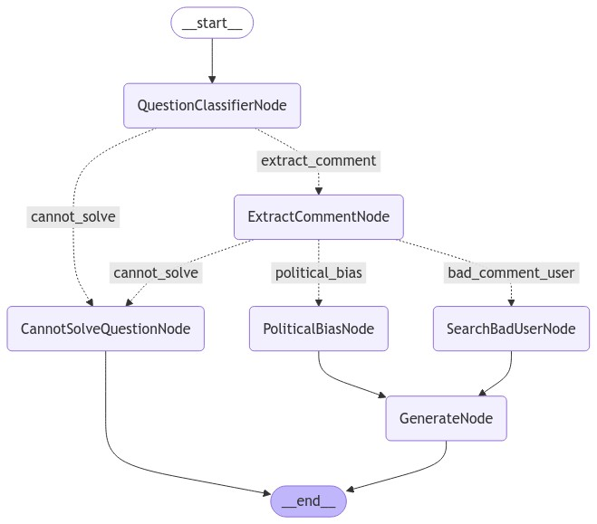
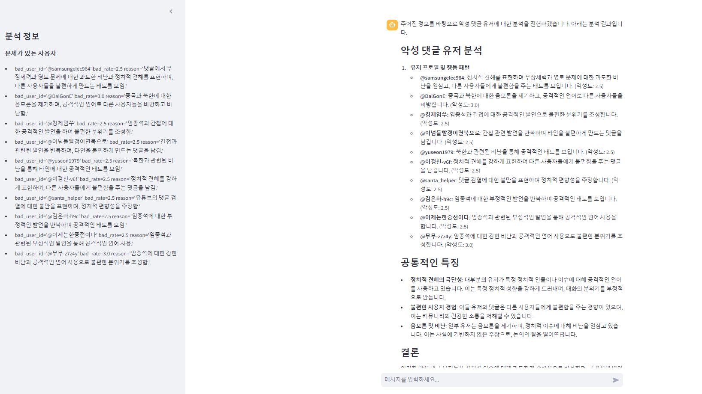
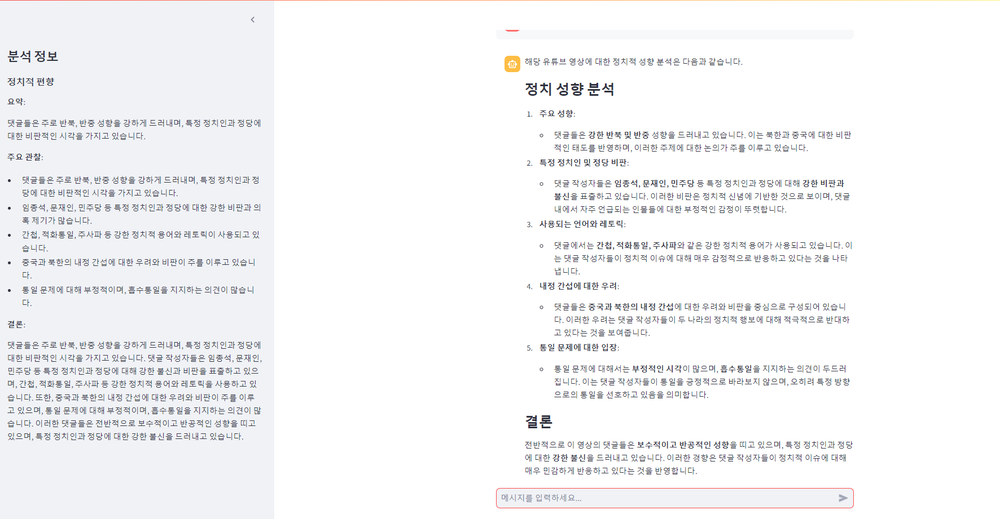

## Youtube Comment Analyzer

YouTube 댓글 분석 챗봇은 사용자가 제공한 YouTube 동영상의 댓글을 분석하여 정치적 성향과 악성 사용자를 식별하는 AI 기반 도구입니다.

### 프로젝트 구조

```text
youtube-comment-analyzr/
├── youtube_comment_analyzr/
│ ├── ai/
│ │ ├── graph/
│ │ │ ├── classifier_node.py
│ │ │ ├── flow.py
│ │ │ ├── generate_node.py
│ │ │ ├── political_bias_node.py
│ │ │ ├── search_bad_user_node.py
│ │ │ └── state.py
│ │ └── prompts/
│ │ └── system_prompts.py
│ ├── youtube/
│ │ └── comment_tool.py
│ └── main.py
├── .gitignore
├── pyproject.toml
└── README.md
```

## 주요 기능

1. YouTube 댓글 분석
2. 정치적 성향 파악
3. 악성 사용자 식별
4. 사용자 질문에 대한 AI 응답 생성

## 노드 및 그래프 구성



이 프로젝트는 LangChain과 LangGraph를 사용하여 다음과 같은 노드로 구성된 그래프를 만듭니다:

1. Classifier Node: 사용자 질문을 분류하여 적절한 처리 경로를 결정합니다.
2. Political Bias Node: 댓글의 정치적 성향을 분석합니다.
3. Search Bad User Node: 악성 사용자를 식별합니다.
4. Generate Node: 분석 결과를 바탕으로 사용자 질문에 대한 응답을 생성합니다.

이 노드들은 `flow.py`에서 정의된 그래프로 연결되어 있습니다.

## 챗봇 기능

이 챗봇은 다음과 같은 기능을 제공합니다:

1. YouTube 동영상 URL 또는 ID를 입력받아 해당 동영상의 댓글을 분석합니다.
2. 댓글의 전반적인 정치적 성향을 파악하고 요약합니다.
3. 악성 사용자를 식별하고 목록화합니다.
4. 사용자의 질문에 대해 분석 결과를 바탕으로 통찰력 있는 답변을 제공합니다.
5. Streamlit을 사용한 대화형 웹 인터페이스를 제공합니다.

## 환경 설정

프로젝트 실행을 위해 `.env` 파일에 다음 항목을 설정해야 합니다:

```.env
OPENAI_API_KEY=your_openai_api_key
YOUTUBE_API_KEY=your_youtube_api_key
```

## 설치 및 실행

1. 저장소를 클론합니다.
2. Poetry를 사용하여 의존성을 설치합니다: `poetry install`
3. 환경 변수를 설정합니다.
4. `poetry run streamlit run youtube_comment_analyzr/main.py`로 애플리케이션을 실행합니다.

## 애플리케이션 실행 화면





